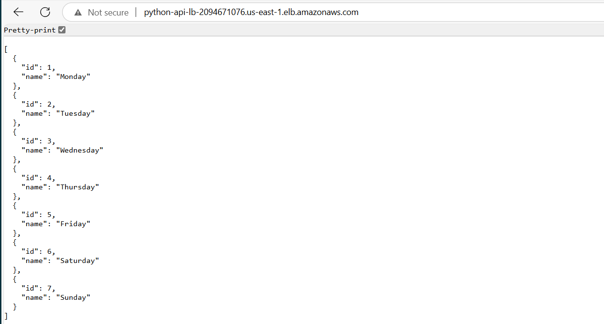

# Flask API Deployment on AWS using ECS

This project demonstrates how to:
- Containerize a Flask API using Docker
- Deploy the containerized app on AWS using ECS
- Automate the infrastructure provisioning using **Terraform** 
- Automate Docker build and ECR push via a **Bash deployment script**
- Force ECS service to redeploy the new container

---

## 🏗️ Architecture Overview

## 🚦 Step-by-Step Traffic Flow

### 1. 🧑‍💻 Client Request
- A user (via a browser, Postman, or another HTTP client) initiates a request to the API.
- Example URL: `https://api.example.com/endpoint`
---
### 2. 🌐 Domian Provider 
- If a custom domain is used, **Amazon Route 53** resolves `api.example.com` to the **Application Load Balancer (ALB)**.
- DNS records (A/AAAA) point to the ALB's public DNS name.
---
### 3. 🎯 Application Load Balancer (ALB)
- **Listens** on HTTP (port 80) and/or HTTPS (port 443).
- Routes incoming requests to ECS tasks based on:
  - **Host-based routing** (e.g., `api.example.com`)
  - **Path-based routing** (e.g., `/api/v1/*`)
- Performs **health checks** on ECS tasks to ensure they’re healthy before routing traffic to them.
---
### 4. 🚢 Amazon ECS (Fargate)
- ALB forwards the request to one of the **ECS Tasks** running in the **ECS Service**.
- Each task:
  - Runs a Docker container hosting the Flask API.
  - Listens internally on a port (e.g., 5000).
- The ECS Service:
  - Maintains the desired number of healthy tasks.
  - Restarts failed tasks automatically.
---
### 5. 🐍 Flask API (Inside Docker Container)
- The Flask API handles the incoming request.
- Executes the necessary logic (e.g., querying databases, processing data).
- Returns a response (e.g., JSON) back through the same flow:
  - Flask API → ECS Task → ALB → Client

---

## 🛠️ Supporting Components

### 📦 Amazon ECR
- Stores the Docker image of the Flask API.
- ECS pulls the latest image from ECR during deployments.
---
### 🔐 IAM Roles
- Grant ECS the necessary permissions to:
  - Pull Docker images from ECR.
  - Send logs to CloudWatch.
  - Interact with other AWS services if needed.

---

**Components:**
- **Flask API**: A simple Python-based web API.
- **Docker**: Used to containerize the Flask application.
- **Amazon ECR**: Docker image registry where the app image is pushed.
- **Amazon ECS (Fargate)**: Used to run the containerized application serverlessly.
- **Terraform**: Infrastructure as Code tools to provision AWS resources such as:
  - VPC
  - Subnets
  - Security Groups
  - ECS Cluster & Service
  - IAM roles
  - ECR Repository

---

## 🚀 Steps & Structure

### 1. Containerize the Flask API
- Dockerfile created to package the Flask app with dependencies.

### 2. Infrastructure as Code
- **Terraform** (preferred for cloud-agnostic flexibility)

Both approaches provision:
- ECS Cluster
- Fargate Task Definition
- Service with Load Balancer (optional)
- IAM roles & policies
- ECR Repository

### 3. Deployment Bash Script
A deployment script automates:
- Building the Docker image
- Logging into ECR
- Tagging and pushing the image
- Forcing ECS service to redeploy

## 🏗️ Application Output
